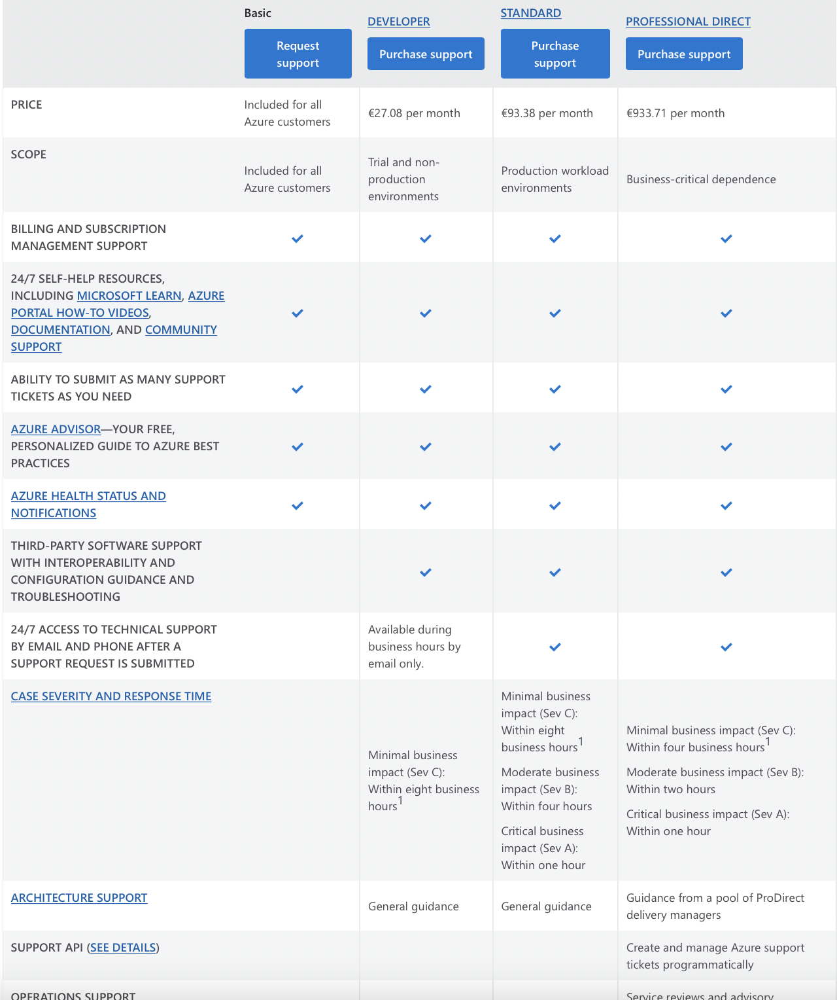

# Azure Support Plans

Every Azure subscription includes free access to billing and subscription support, Azure products and services documentation, online self-help documentation, white papers, and community support forums.

## Exercise

Study Azure Support Plans

### Results

Microsoft offers four support plans that can provide you with technical support:

- Basic: Available to all Microsoft Azure accounts, this is the only free plan and does not have any active support from Azure, the user has access to community forums, self-help documentation, etc, and can raise as many support tickets as required.

- Developer: Best suggested for trial and non-production environments, This plan has active support from Azure in the form of access to support engineers via email during standard Business hours. The response time from Microsoft for this plan is within eight hours.

- Standard: Best suggested for production workload environments, this plan is an upgrade of the developer plan and provides support in the form of 24×7 access to support engineers via email and phone. The response time from Microsoft for this plan is within one hour.

- Professional Direct: Absolutely necessary for business-critical environments, this plan also offers 24/7 technical support with one-hour response time but also includes operational support, training, and proactive guidance from a ProDirect delivery manager.

 

---

If you have an enterprise agreement with Microsoft, you can purchase any of these plans except the Developer plan and the bill will be incorporated in the enterprise agreement.

Microsoft provides support in nine languages: English, Spanish, French, German, Italian, Portuguese, Traditional Chinese, Korean, and Japanese

---
---
To see the Support plans, go to Help + support in the Portal

My Azure Portal with the support plans

### Comparison

For a comparison between Azure and AWS Support plans see [Comparison](https://kinsta.com/nl/blog/aws-en-azure/#ondersteuning)

### Sources

https://azure.microsoft.com/en-us/support/plans/

https://k21academy.com/microsoft-azure/az-900/az-900-azure-support-options/

https://kinsta.com/nl/blog/aws-en-azure/#ondersteuning