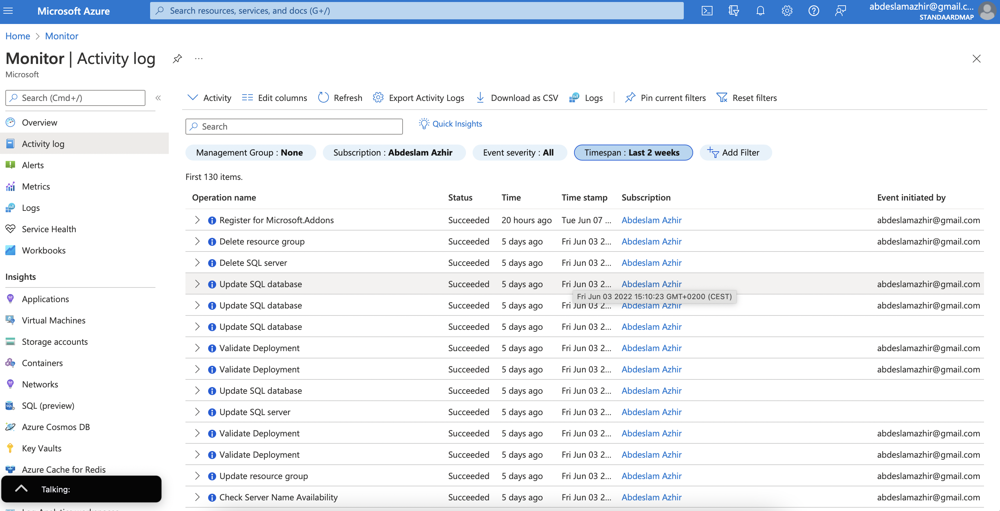

# Azure Activity Log

The Activity log is a platform log in Azure that provides insight into subscription-level events. Activity log includes such information as when a resource is modified or when a virtual machine is started. 

Activity log events are retained in Azure for 90 days and then deleted.

Azure activity log allows the creation of an diagnostic setting to forward the log to the following services:

- to Azure Monitor Logs for more complex querying and alerting, and longer retention (up to 2 years)  

- to Azure Event Hubs to forward outside of Azure  

- to Azure Storage for cheaper, long-term archiving 

---

The Monitor Activity Log  with my activity for the past two weeks.

The logs can be downloaded from Download as CSV and the history can be viewed via the Change History (Preview) tab

You can also access Activity log events using the following methods:

- Use the Get-AzLog cmdlet to retrieve the Activity Log from PowerShell.

- Use az monitor activity-log to retrieve the Activity Log from CLI. 

- Use the Azure Monitor REST API to retrieve the Activity Log from a REST client.

## Exercise

Study Azure Activity Log

### Sources

https://docs.microsoft.com/en-us/azure/azure-monitor/essentials/activity-log
