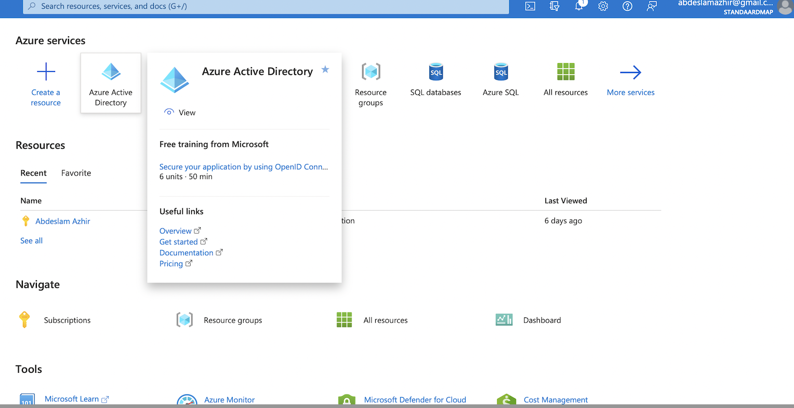

# Azure Active Directory

### What is the Azure Active Directory?

Azure Active Directory (Azure AD) is Microsoft’s enterprise cloud-based identity and access management (IAM) solution

For an organization, Azure AD helps employees sign up to multiple services and access them anywhere over the cloud with a single set of login credentials.

All employees in an organization need access to some Azure services to perform their tasks. They can access services like SQL database, or Azure container services when the administrator assigns them separate user id and password for each service. Employees, as well as administrators, often find it hard to manage multiple user logins at the same time. It creates more of a hassle for administrators working in an organization that involves more than 1000 employees. 

This is where Azure Active Directory (AD) comes into the picture. With Azure AD, the administrators can handle multiple user logins without any issue. Administrators need to assign a single username and password to access all the services they want. 

### Who uses Azure AD?

- IT admins: As an IT admin, use Azure AD to control access to your apps and your app resources, based on your business requirements.

- App developers: As an app developer, you can use Azure AD as a standards-based approach for adding single sign-on (SSO) to your app, allowing it to work with a user's pre-existing credentials.

- Microsoft 365, Office 365, Azure, or Dynamics CRM Online subscribers: As a subscriber, you're already using Azure AD. Each Microsoft 365, Office 365, Azure, and Dynamics CRM Online tenant is automatically an Azure AD tenant.

### Licenses

Microsoft Online business services, such as Microsoft 365 or Microsoft Azure, require Azure AD for sign-in activities and to help with identity protection. If you subscribe to any Microsoft Online business service, you automatically get Azure AD with access to all the free features.

You can also add paid capabilities by upgrading to Azure Active Directory Premium P1 or Premium P2 licenses.

## Key terminology

- Forest: A forest is a logical construct used by Active Directory Domain Services (AD DS) to group one or more domains. The domains then store objects for user or groups, and provide authentication services

- OU: Organizational unit in active directory is a container where we can place users, computers, groups and other organization units even. OU are helps to create logical structure of the AD. We can use it to assign group policies and manage the resources.

- LDAP: Lightweight Directory Access Protocol is an application protocol for working with various directory services sych as Active Directory.

- NTLM: New Technology LAN Manager is a suite of security protocols offered by Microsoft to authenticate users’ identity and protect the integrity and confidentiality of their activity. At its core, NTLM is a single sign on (SSO) tool that relies on a challenge-response protocol to confirm the user without requiring them to submit a password.

- Kerberos: A computer network security protocol that authenticates service requests between two or more trusted hosts across an untrusted network, like the internet. It uses secret-key cryptography and a trusted third party for authenticating client-server applications and verifying users' identities.

## Exercise

Study Azure Active Directory.

---

### Where can I find this service in the console?

In the Azure Portal

---
---

### How do I enable this service?

I don't have acces rights to create a user, instead I invited a user.

---
---
The invite e-mail I received

---
---

The empty portal for the user I invited.

### Comparison

Azure Directory (AD) vs Azure Active Directory (Azure AD)

Azure AD is not simply a cloud version of AD, they do quite different things. AD is great at managing traditional on-premise infrastructure and applications. Azure AD is great at managing user access to cloud applications. You can use both together, or if you want to have a purely cloud based environment you can just use Azure AD.

- Azure AD Benefit 1
  - Azure Active Directory is a secure online authentication store, which can contain users and groups. Users have a username and a password which are used when you sign into an application that uses Azure AD for authentication. So for example all of the Microsoft Cloud services use Azure AD for authentication: Office 365, Dynamics 365 and Azure. If you have Office 365, you are already using Azure AD under the covers.
  ---

- Azure AD Benefit 2
  - As well as managing users and groups, Azure AD manages access to applications that work with modern authentication mechanisms. Applications are an object that exist in Azure AD, and this allows you to create an identity for your applications (or 3rd party ones) that you can grant access for users to. Besides seamlessly connecting to any Microsoft Online Services, Azure AD can connect to thousands of SaaS applications (e.g. Salesforce, Slack, ZenDesk etc) using a single sign-on.
---

When compared with AD, here is what Azure AD doesn’t do:

- You can’t join a server to it

- You can’t join a PC to it in the same way – there is Azure AD Join for Windows 10 only 

- There is no Group Policy

- There is no support for LDAP, NTLM or Kerberos

- It is a flat directory structure – no OU’s or Forests
So Azure AD does not replace AD.

Summary:

- AD is great at managing traditional on-premise infrastructure and applications. 
- Azure AD is great at managing user access to cloud applications. 

They do different things with the area of overlap being user management.

---
---

### Sources

https://www.simplilearn.com/tutorials/azure-tutorial/azure-active-directory

https://www.varonis.com/blog/azure-active-directory

https://docs.microsoft.com/en-us/azure/active-directory/fundamentals/active-directory-whatis

https://docs.microsoft.com/en-us/azure/active-directory-domain-services/concepts-resource-forest

https://www.compete366.com/blog-posts/the-difference-between-ad-and-azure-ad-explained/

https://docs.microsoft.com/en-us/azure/active-directory/fundamentals/auth-ldap

https://www.crowdstrike.com/cybersecurity-101/ntlm-windows-new-technology-lan-manager/

https://www.simplilearn.com/what-is-kerberos-article
