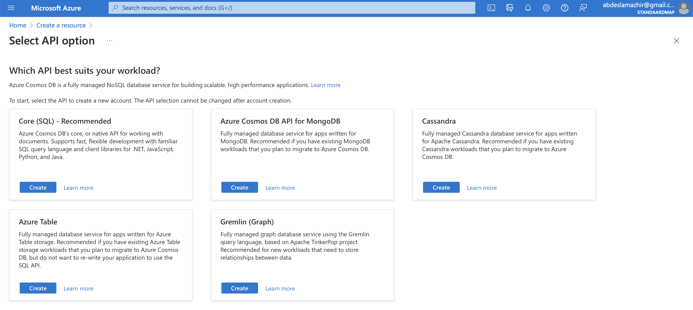
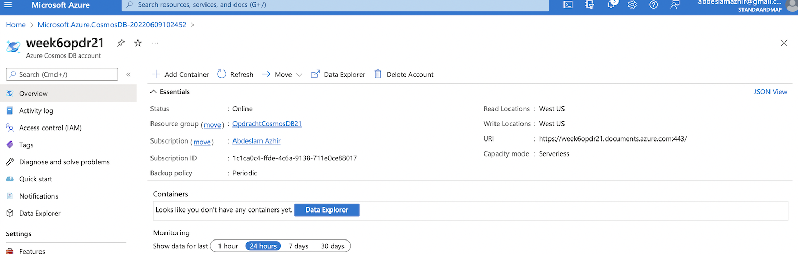
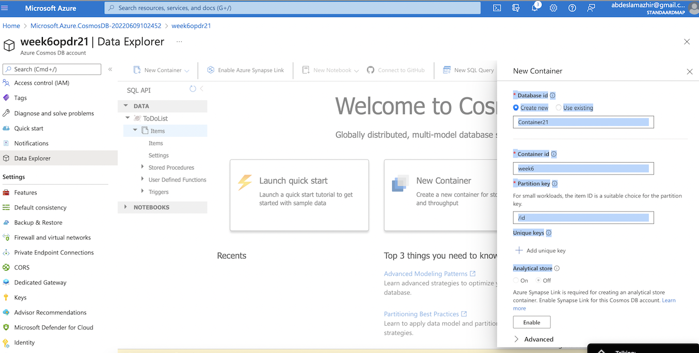
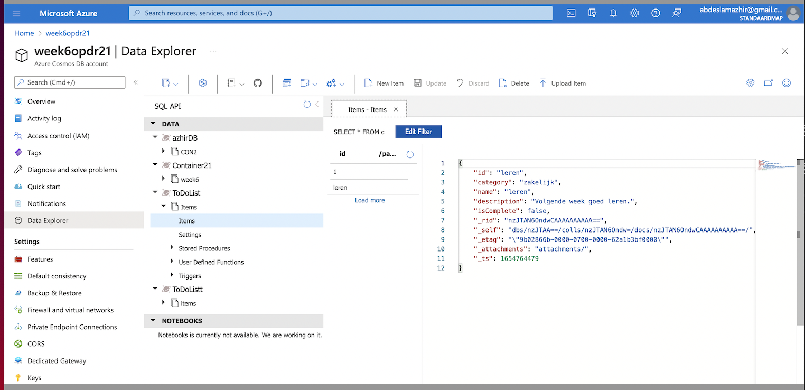

# Cosmos DB 

### What is Cosmos DB?

Cosmos DB is a database service that is globally distributed. It allows you to manage your data even if you keep them in data centers that are scattered throughout the world. It provides the tools you need to scale both global distribution pattern and computational resources.

It can support multiple data models using one backend. This means that it can be used for document, key value, relational, and graph models. It is more or less a NoSQL database because it does not rely on any schemas.

You can choose from multiple database APIs including the native Core (SQL) API, API for MongoDB, Cassandra API, Gremlin API, and Table API

---
---

## Key terminology

- NoSQL: NoSQL stands for Not Only SQL and it is a collective name for many different databases that do not really match. An important similarity is that all these database management systems differ significantly from classical relational databases. NoSQL databases can process extremely large amounts of data, also known as big data. Moreover, this data does not need to have a (semi)structure in advance.

- SDK: A software development kit (often abbreviated to SDK) is a collection of tools that are useful in developing computer programs for a particular operating system, type of hardware, desktop environment, or for creating software that uses a special technique.

- ETL: Extraction, Transformation and Load. It identifies the processes used to unite data from different structured databases into another database.

  - Extract: getting data from a source

  - Transform: Convert retrieved data according to rules and create lookup tables or combinations of data from different sources

  - Load: write the data to another place

---
---

## Advantages

- Guaranteed speed at any scale
  - Gain unparalleled SLA-backed speed and throughput, fast global access, and instant elasticity.

- Simplified application development
  - Build fast with open source APIs, multiple SDKs, schemaless data and no-ETL analytics over operational data.

- Mission-critical ready
  - Guarantee business continuity, 99.999% availability, and enterprise-level security for every application.

- Fully managed and cost-effective
  - End-to-end database management, with serverless and automatic scaling matching your application and TCO needs

---
---

## Exercise

Study Azure Cosmos DB.

### Results

Creating an Azure Cosmos account, database, container, and items from the Azure portal

Created a Core (SQL) Database account

The deployd account

Adding a database and a container

Adding data to the database

---
---

### Sources

https://docs.microsoft.com/en-us/azure/cosmos-db/introduction

https://docs.microsoft.com/en-us/azure/cosmos-db/sql/create-cosmosdb-resources-portal
