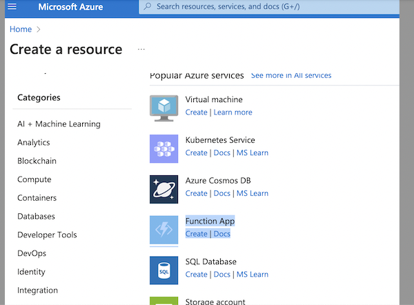
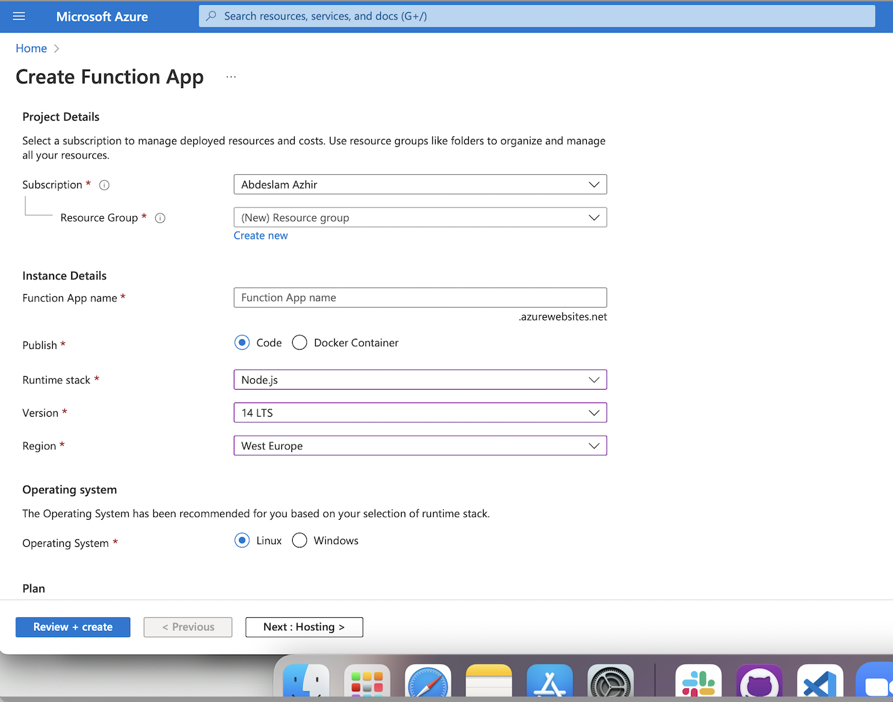
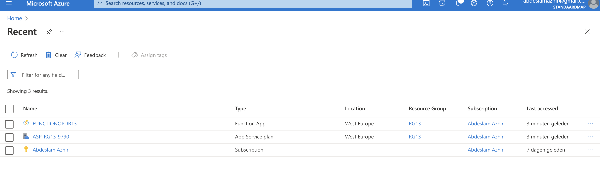
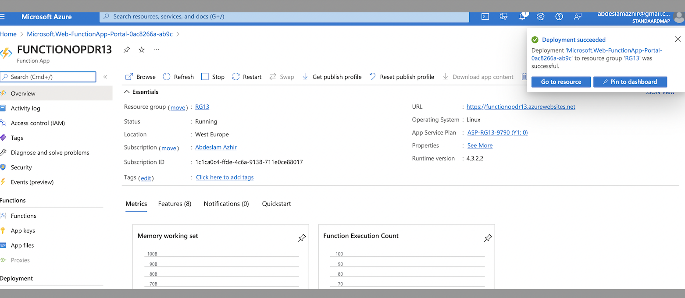
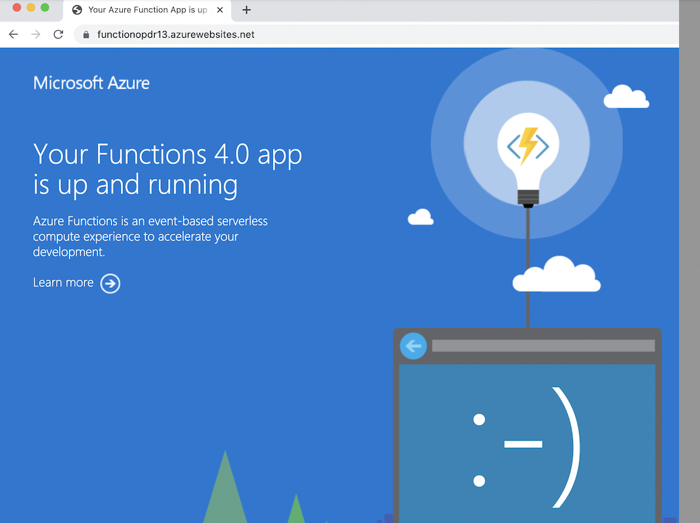
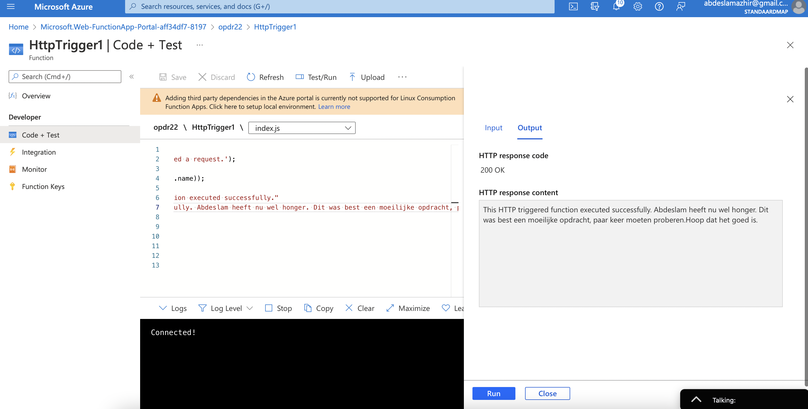
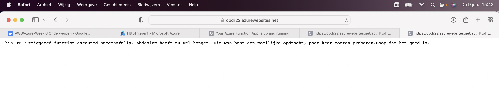

# Azure Functions 

### What are Azure Functions?

Azure Functions is a cloud service available on-demand that provides all the continually updated infrastructure and resources needed to run your applications. Azure Functions lets you develop serverless applications on Microsoft Azure. You can write just the code you need for the problem at hand, without worrying about a whole application or the infrastructure to run it.

Azure Functions are a great solution for processing data, integrating systems, working with the internet-of-things (IoT), and building simple APIs and microservices. Consider Functions for tasks like image or order processing, file maintenance, or for any tasks that you want to run on a schedule. Functions provides templates to get you started with key scenarios.

Azure Functions supports triggers, which are ways to start execution of your code, and bindings, which are ways to simplify coding for input and output data. There are other integration and automation services in Azure and they all can solve integration problems and automate business processes. They can all define input, actions, conditions, and output.

### For what using Azure Functions?

Azure Logic App can define a workflow at ease consuming a range of APIs as connectors. These connectors will perform series of actions defined in the workflow. Like Azure Logic Apps, durable Azure Functions can also be used to define workflow in code structure.

- Trigger:
  - Azure Functions can be triggered with the configured trigger like HTTPTrigger, TimerTrigger, QueueTrigger and more	

- Defining Workflow	
  - Workflow in Azure Functions can be defined using Azure Durable Function. It consists of Orchestrator Function that has the workflow defined with Several Activity Functions

- Monitoring	
  - Azure Functions can be monitored using Application Insights and Azure Monitor

- Supported languages	
  - Azure Functions support various languages like C#, F#, JavaScript, node.js and more

 - Deployment	
   - Azure Functions is a separate App Service that run in the App Service Plan

## Key terminology

## Exercise

### Results

Creating a Azure Function App

The deployd app with te url link

The Function App up and running.

Test the code in the Portal

The result.

### Sources

https://www.serverless360.com/azure-functions

https://docs.microsoft.com/en-us/azure/azure-functions/functions-get-started?pivots=programming-language-csharp

https://docs.microsoft.com/en-us/azure/azure-functions/create-first-function-vs-code-python