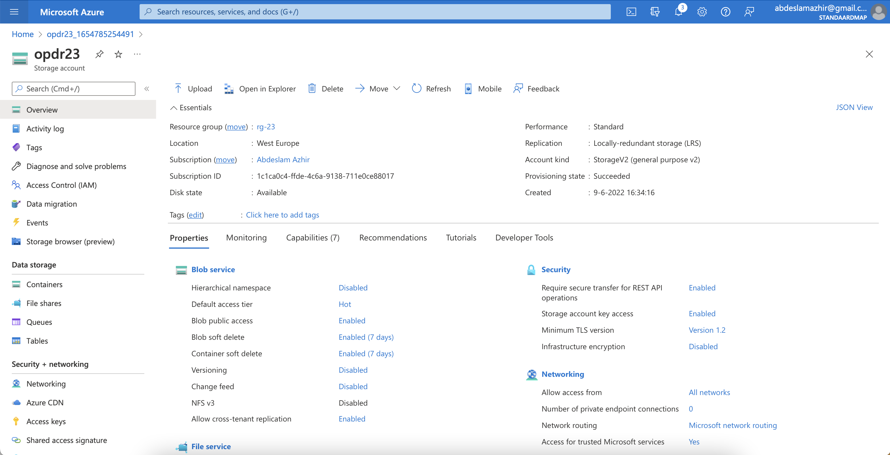
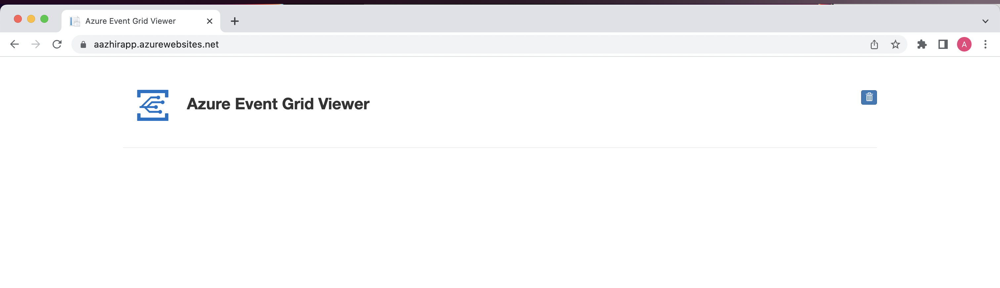
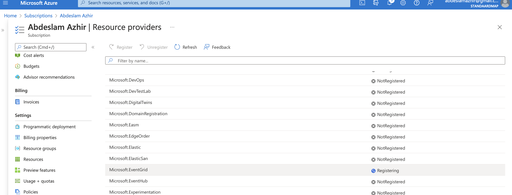
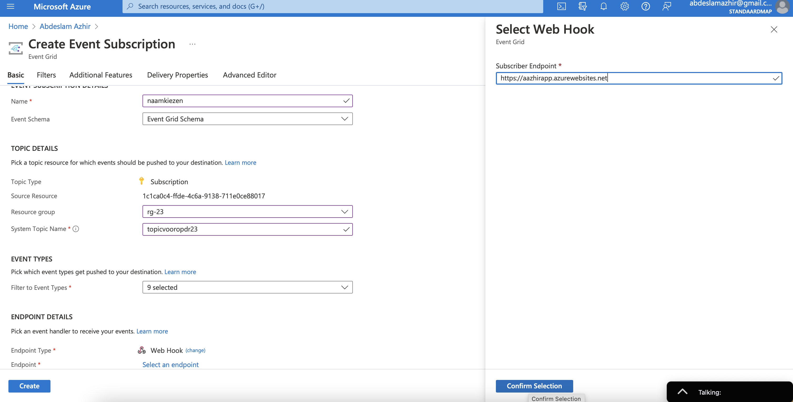

# Event Grid, Queue Storage, Service Bus

### What is Event Grid?

Azure Event Grid allows you to easily build applications with event-based architectures

Azure Event Grid is a complete event routing service actively running on top of Azure Service Fabric. Event Grid issues events from various services like Azure Storage Blobs to different handlers like Azure Functions. Azure Event Grid was invented to build event-based and serverless applications on Azure at an ease. Azure Event Grid provisions almost of the Azure services as publisher or subscriber which can be consumed within third party services. It stipulates a dynamically scalable, low-cost communication system that permits publishers to acknowledge subscribers regarding the status change. Certain concepts are used in Azure Event Grid to connect a source to a subscriber.

### How does Azure Event Grid work?
Azure Event Grid can connect to any application that you create, and the Events generated by the application can be pulled and published to different other destinations. And the fun part is that all of these can be achieved with minimum coding efforts or even with no coding.

---

### What is Queue Storage?

Azure Queue Storage is a service for storing large numbers of messages. You can access messages anywhere in the world via authenticated calls over HTTP or HTTPS. A queue message can be up to 64 KB in size. A queue can contain millions of messages, up to the total capacity limit of a storage account.

Queue Storage contains the following components:

- URL format: Queues are addressable using the following URL format:
https://<storage account>.queue.core.windows.net/<queue>
The following URL addresses a queue in the diagram:
https://myaccount.queue.core.windows.net/images-to-download

- Storage account: All access to Azure Storage is done through a storage account. For information about storage account capacity, see Scalability and performance targets for standard storage accounts.

- Queue: A queue contains a set of messages. The queue name must be all lowercase. For information on naming queues, see Naming queues and metadata.

- Message: A message, in any format, of up to 64 KB. Before version 2017-07-29, the maximum time-to-live allowed is seven days. For version 2017-07-29 or later, the maximum time-to-live can be any positive number, or -1 indicating that the message doesn't expire. If this parameter is omitted, the default time-to-live is seven days.

### What is Service Bus?

Azure Service Bus is a messaging service on cloud used to connect any applications, devices, and services running in the cloud to any other applications or services. As a result, it acts as a messaging backbone for applications available in the cloud or across any devices.

---
---

## Key terminology

 
- Event: Events are the data or information traveling through Azure Event Grid that describes the actions that took place in a system. All events have common properties like a source of an event, the time at which the event occurred, and a unique identifier. Every event has detailed information that is relevant to that event. Each event is independent with a size up to 64KB covered by General Availability Service Level Agreement.
In general, an event is sent to indicate something that has happened or changed. However, the actual object that was changed is not part of the event data. Instead, a URL or identifier is often passed to reference the changed object.

- Publisher: Publishers are users or a third party that chooses to send events to Azure Event Grid. Microsoft publishes events for various Azure services and from the user’s application also.

## Exercise

Study Event Grid, Queue Storage andService Bus

### Overcome challanges

Very difficult exercise.

### Results
Created a Storage Account

### Sources

https://docs.microsoft.com/en-us/azure/event-grid/overview

https://www.serverless360.com/azure-event-grid

https://docs.microsoft.com/en-us/azure/storage/queues/storage-queues-introduction

https://www.serverless360.com/azure-service-bus

https://docs.microsoft.com/en-us/azure/event-grid/blob-event-quickstart-portal